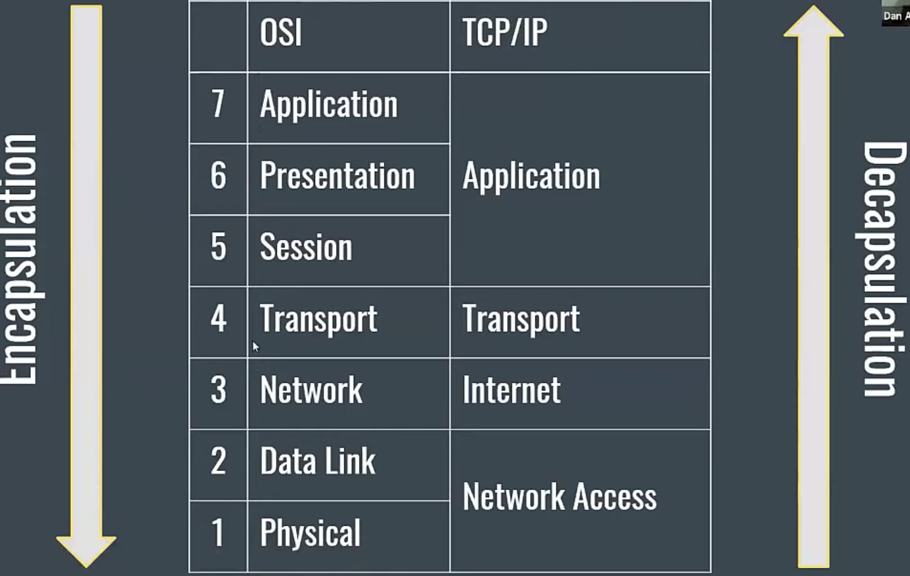

# basic_linux

##  User management
`adduser`: add a user to the system.\
`userdel`: delete a user account and related files.\
`addgroup`: add a group to the system.\
`delgroup`: remove a group from the system.\
`usermod`: modify a user account.\
`chage`: change user password expiry information.\
`sudo`: run one or more commands as another user (typically with superuser permissions).\

Relevant files: `/etc/passwd` (user information), `/etc/shadow` (encrypted passwords), `/etc/group` (group information) and `/etc/sudoers` (configuration for sudo).\

Find Kernal version: `uname -a` \

Find current IP address\
Old way: `ifconfig` New way: `ip` \
How to check free disk space: `df -ah`\
How do you manage services on a system?\
Newer system: `systemd`\
`service <service_name> stop/start/status/restart`\

Login to multiple linux servers: `csshx IP IP IP`\

## How to Encypt Password: Run below command in git bash
`winpty openssl passwd -6 -salt $(head /dev/urandom | tr -dc 'a-zA-Z' | head -c 16)`

# What is /etc/sudoers ?
```
root ALL=(ALL:ALL) ALL
%admin ALL=(ALL:ALL) ALL
%www ALL=(ALL:ALL) NOPASSWD=ALL
```
  - root user can run ALL commands from ALL(any) Host with ALL users and ALL groups
  - `%` means groups and NOPASSWD=ALL means does't require to pass to run all commands

# lost+found folder
- corrupted files are stored in this folder
- you will find this folder in each partition of the disk, like root and any other mounts

# tar command to zip the file
`tar -czvf test.tar dir_or_filename`
`tar -xvf test.tar`   

# What does the immutable bit do to a file?
* makes files unchangable so that it cannot be erased during software upgrades
```
chattr +i filename # set immutable bit, root user cannot delete and modify the file
chattr -i filename # remove immutable bit
lsattr # list the immutable files

MAC OS:
sudo chflags schg immutablefile.txt
sudo chflags noschg immutablefile.txt

rm -rf immutablefile.txt
rm: cannot remove 'immutablefile.txt': Operation not permitted
```

# What is /etc/services?
* list of ports/TCP Protocol is a small local database that lists all server programs

# hardlinks and softlinks:

hardlinks:

Is another name for a file and it cannot be used for directories and filesystem.\
Its inode address remains same. Even original file is deleted, hardlink still points to same inode address and can open the content.\
Changes to the file content is reflected to all hardlinks.\
File is only deleted once all the hardlinks are deleted\
Hardlink have same inode

command:
```
ln filename hardlink_name
```

Softlinks:

Its points to another entry somewhere in the file system.
ability is link directory in same file system or over the network
Deleting target file makes symbolic link useless
sym link creates separate inode from target file.


find the file name ending with .md and look for content apple
```
find . -name "*.md"|xargs grep -i "apple"
find . -name "*.md" -exec grep -H "apple" {} \;
grep -ir "apple" .
```

# .profile .bash_profile .bashrc
bashrc and bash_profile are system files and are hidden\
bashrc -  interactive non-login\
bash_profile - interactive login

The default shell, a Bourne shell, reads commands from ~/.profile(for all shell) when it is invoked as the login shell.\
Bash is a Bourne-like shell. It reads commands from ~/.bash_profile(only for bash) when it is invoked as the login shell,\
and if that file doesn't exist, it tries reading ~/.profile instead and it compatible with any bash shell.\
And If file doesn't exist it reads from /etc/profile and set java path.

Once login is completed, opening new terminal runs bashrc (path, alias, terminal settings).\

For MaC OS, it runnings login shell every time.

# DNS Commands:
```
host
nslookup
dig
python -c "import socket;print(socket.gethostbyname('example.com'))"
```

# Controls
ctrl+c aborts process immediately\
ctrl+z suspends process(stop)

jobs command will list suspended(stopped) process
`kill %n (n is the suspended process number)`

# postfix is mail service running in linux box

# Standard out and standard error(file descriptor)
* 0 -> Standard input :reading from keyboard file
* 1 -> standard output : writing  to screen
* 2 -> standard error : writing to error file and  --> output to screen
```
script &> output.txt #shortcut to redirect stdout and stderr
script 1> output.txt 2>&1  
./standard_error_output.py  1> stderr.txt 2>&1
```
## & nohup and disown:
* script & --> runs process in background but still sends stdout to console
* nohup script & --> runs process in background and process keeps running even if terminal is session out or terminated.
It redirects stdout and stderr to nohup.out
* disown --> if script is executed in background but forgot to use nohup, run disown script to keep running in background even if terminal is Terminated

`disown script`

# load average:
* measures average load every 1m, 5m and 15m
```
uptime
top
  ```

# Virutal Memory
# swap memory

# What is sticky bit:
A sticky bit is a permission bit that is set on a directory that allows only the owner of the file within that directory or the root user to delete\ or rename the file. No other user has the needed privileges to delete the file created by some other user.

To remove sticky bit:
`sudo chmod -t /tmp`

To set sticky bit:
`$ sudo chmod +t /tmp`

# check open files:
`lsof`

# What is the command used to show all open ports and/or socket connections on a machine?
```
$ lsof -i
$ netstat -natupx
$ ss -lptuxa
```

# netcat (nc)
* Netcat (or nc) is a command-line utility that reads and writes data across network connections, using the TCP or UDP protocols
* Can share files remotely
* Can share messages remotely
```
nc -lvp 2222 # on remote server
  hello - received message
nc x.x.x.x(remote server IP) port(2222)
  hello # sent message

nc -lvp 2222 > fileshared.txt
nc x.x.x.x port < test.txt
```
# zombie process(defunc):

You can't really "kill" zombie processes because, well, they're already dead.

zombie processes are not orphan processes, they are dead processes: processes that have finished executing and are waiting for the parent to reap them (collect information about their status). You are barking up the wrong tree trying to kill a zombie process because they are already dead. To get rid of a zombie process, kill its parent. Hope that helps.

# orphan process:

When parent finishes the process before child and close the process without waiting for child to finish,
child process becomes orphan and init process becomes the parent process.

orphan process can be stopped using kill command

# PROCESS STATE CODES:
* R  running or runnable (on run queue)
* D  uninterruptible sleep (usually IO)
* S  interruptible sleep (waiting for an event to complete)
* Z  defunct/zombie, terminated but not reaped by its parent
* T  stopped, either by a job control signal or because
      it is being traced

# kernal panic


# Output to console and and the file:
```
echo "dfjks ahfkdf"|tee -a /tmp/tee.txt
```
# Enable package forwarding
* Sets ip_forwarding to true, default is 0. allows port forwarding
```
echo 1 > /proc/sys/net/ipv4/ip_forward
echo 0 > /proc/sys/net/ipv4/ip_forward #disable package forwarding
```


# What is shell variable?
* User define variable
  ```
  id=10
  name="Dorji"
  ```
* Environment variable
* export name # is the environment variable
  are defined by Shell
  ```
  PATH
  HOME
  TERM
  SHELL
  ```
* Predefined variable
  ```
  $1 $2
  ```
# Export command
* pass environment variable to other processes
* printenv, can use them to store passwords or api keys, store temporary files
```
name="dorji"
echo $name  
printenv name
export name
printenv name
```
* Once the terminal is closed, environment variable is removed

# SNMP(Simple Network Management Protocol):

# DNS:
pointer record(PTR) or reverse DNS lookup\
A record maps the domain name to an IP address, the PTR record maps the IP address to a hostname

`dig -x <IP address>`

# Boot process:
* BIOS(basic Input/Output system): hardware check execute MBR
* MBR(master boot record): executes grub
* GRUB(Grand Unified Boot loader): executes kernel
* Kernel - execute /sbin/init
* Init - executes run level
* Runlevel

# Runlevels:
0 = halt (shutdown)\
1 = single user mode\
2 = multi user mode\
3 = multi user with networking(no GUI)\
4 = un used\
5 = multi user with networking with GUI\
6 = reboot

Change default runlevel in the file /etc/inittab

# Managing boot process
init script:
```
/init.d/(start,stop,restart, status)
chkconfig
```

pstree command gives hierachy of process initiated. In linux, init process is first process created with process ID 1

dmesg command to list boot loader logs /var/log


# How SSH key works?

secure shell - cryptographic network protocol
  used for accessing remote server\
  ssh uses a Asymmetric Cipher (Public and private key pair)\
  cipher is algorithm performing encryption and decryption\
  there are many encryption method(rsa, dsa, ed25519)\
  Public key is used for encrypting data and private key is used for decrypting the data

copy public key to remote server:
```
ssh-copy-id - ~/.ssh/id_rsa_pub tdorji@x.x.x.x
or scp
```

# known_hosts
stores server's public key in the user computer and remembers the server. If the server is recreated, it will showing warning.
# authorized_keys
exist on server side. The private key is kept on the computer you log in from, while the public key is stored on the .ssh/authorized_keys file on all the severs you want to log in to.
```
ssh-keygen  #command to generate ssh key pair
```
can change the login behavior in the file /etc/ssh/ssh_config  /etc/ssh/sshd_config
Save all the host details in ~/.ssh/config


# Type of files in Linux:
* `-` : regular file
* d : directory
* c : character device file:  ls -ld /dev/vmmon Character and block device files allow users and programs to communicate with hardware peripheral devices.
* b : block device file: ls ld /dev/sda  Block devices are similar to character devices. They mostly govern hardware as hard drives, memory, etc
    `mknod` is the command to create block devices
* s : local socket: ls -ld /dev/log file Local domain sockets are used for communication between processes. Generally, they are used by services such as X    windows,  syslog and et
* p : named pipe: Similarly as Local sockets, named pipes allow communication between two local processes. They can be created by the mknod command and removed with the rm command.
* l : symbolic link

Process and thread:
* Fork gives you a brand new process which is a copy of the current process, with same code segments.
* thread - lightweight process
* process- memory, processor, virtual mem


# NTP Server (Network time protocol)
* ntpq -p # reachability statistics -

# How can you limit process memory usage?
`ulimit -sv`

# How can you tell if the httpd package was already installed?
`dpkg --get-selections | grep apache`


# RAID:
- Is Redundant Array of Inexpensive disks
- Raid is just a collection of disks in a pool to become a logical volume
- Create RAID:\
http://iserverinc.us/blog-files/blogs/blog-links/Create-RAID-With-Linux/How-to-create-a-software-RAID-on-LINUX.pdf

# Logical Volume management(LVM)
  - Physical Vol
    - Before proceeding with below steps, need to need EBS vol and attached them to vol.
      Find list of vols:
      `lsblk`
    - Define physical
      ```
        #create physical vol
        pvcreate /dev/sdb
        pvcreate /dev/sdc
        pvcreate /dev/sdd

        pvscan -v #view all physical vol
        ```
  - Group Vol
    ```
      vgcreate <Group_Vol> /dev/sdb #First physical vol
      vgextend <Group_Vol> /dev/sdc /dev/sdd
      pvscan -v
      ```
    - You can only have one Group_Vol, so cannot use vgcreate command to remaining physical VOl.
  - Logical Vol
    ```
    lvcreate -L 10G -n First_Drive Group_Vol
              size    name name_of_the_vol
    lvcreate -L 20G -n Second_Drive Group_Vol
    ```
  - Create File System with LV:
    `mkfs -t file_system(ext4 or ext3) /dev/group_vol/logical_vol`
  - mount LV:
    `mkdir /mount_point`
    `mount -t file_system /dev/group_vol/logical_vol /mount_point`

  - Increase size on existing LVM(dynamic extension)
    - Create physical VOl
    - Extend Group Vol
    - Extend LVM

# Devops Questions:
## You need to upgrade kernel at 100-1000 servers, how you would do this?
* Chef or ansible or salt. some configuration management tool

# Splunk Queries:

```
index=index_name|top respStatus
index=index_name earliest=-15m latest=now|stats avg(resp_time_total) as avg_resp| search avg_resp > 2000
index=index_name sourcetype=tomcat|where http_responsecode> 199 |stats count as throughput
index=index_name errorCode!=0 |timechart span=5m count by errorCode
index=index_name total_request_execution_time sourctype=webservice|dedup tid|stats count by error_code
index=index_name |stats dc(tid) as total dc(eval(if(status>=200 AND status<=299, tid, null))) as success dc(eval(if(status>=399, tid, null))) as failure|eval successrate=100*(success/total)
index=index_name Xhost=myhost.com |table _time,xHost,status,svcTime
index=index_name TotalResponseTime|bucket _time span=5m |stats perc50(TotalResponseTime) as Avg_resp_time perc99(TotalResponseTime) as percentile_99

index=index_name  
| stats dc(tid) as requests by providerId ErrorCode
| eventstats sum(requests) as total_requests sum(eval(if(ErrorCode!="0",requests,null))) as total_failures by providerId
| eval perc_per_provider_and_error=100*(requests/total_requests)
| eval perc_overall_failure_per_provider=100*(total_failures/total_requests)
| where perc_overall_failure_per_provider>=1 and ErrorCode!="0"
| lookup getdata_providerlookup.csv id AS providerId OUTPUT name AS providerName
| fieldformat perc_overall_failure_per_provider=round(perc_overall_failure_per_provider,2)."%"
| fieldformat perc_per_provider_and_error=round(perc_per_provider_and_error,2)."%"
| fields providerId providerName ErrorCode total_requests total_failures requests perc_overall_failure_per_provider perc_per_provider_and_error


index=index_name sourcetype=profile executionDetails AcquireOMSMessageListener providerId = "1234"
| stats count as Total, sum(eval(if(ErrorCode!="0",1,0))) as Failure by providerId
| eval Percentage_Failure=Failure*100/Total
| fieldformat Percentage_Failure=round(Percentage_Failure,1)."%"
| where Percentage_Failure > 0
| lookup getdata_providerlookup.csv id AS providerId OUTPUT name AS providerName
| table providerName, Total, Failure, Percentage_Failure

index=index_name ErrorCode!=0 |timechart span=1m count by ErrorCode
index=index_name ErrorCode=-<errorcode>|chart count by ErrorMessage
index=index_name ErrorCode=7500 |timechart span=15m usenull=f count by ErrorMessage
index=index_name ErrorCode!=0 |timechart span=15m useother=f count by ErrorMessage


Dashboard query:
index=index_name respStatus
| timechart span=$tok_span$  count by respStatus
```

# git:

```
#!/bin/bash

# Syncing with upstream

git remote | grep upstream >> /dev/null 2>&1

if [ "$?" != "0" ]; then
        printf "Adding upstream git repo\n"
        git remote add upstream git@github.com:tenzindorji/basic_linux.git
else
        printf "\n"
fi

git pull && \
  git fetch upstream && \
  git merge upstream/master -m "Merge remote-tracking branch 'upstream/master'" && \
  git push

printf "\n"

```

# Basic Mysql:
```
ssh -v DB server
sodu -i
mysql --login-path=admin
mysql -h hostname -u root -p
mysql -u USERNAME -p

#login with SSl certificate
export DBUSER=e2e
mysql -h $DBUSER.xxx.us-west-2.rds.amazonaws.com  -u $DBUSER -p --ssl-ca=rds-combined-ca-bundle.pem --ssl-verify-server-cert

create database dbname;
show databases;
use dbname; #switch DB
show tables;
describe tablename;
drop database dbname; #delete DB
drop table tablename;
select * from tablename; #show all data in a table
show columns from tablename;

#show certain selected rows with the value whatever
select * from tablename where fieldname=whatever;

#insert
INSERT INTO table_name (column1, column2, column3, ...)
VALUES (value1, value2, value3, ...);

INSERT INTO table_name
VALUES (value1, value2, value3, ...); #insert to all col

#Update existing record
UPDATE table_name
SET column1 = value1, column2 = value2, ...
WHERE condition;

UPDATE Customers
SET ContactName = 'Alfred Schmidt', City= 'Frankfurt'
WHERE CustomerID = 1;

#wildcard %
select * from Customers where CustomerName like "Wil%";

#inner join
select Orders.OrderID, Orders.OrderDate, Customers.CustomerName from Orders
inner join Customers on Orders.CustomerID=Customers.CustomerID;

show variables like '%connection%';  

mysqldump -u root -ppassword --opt > /tmp/allmysqldatabases.sql #dump all the databases
mysqldump -u username -ppassword --databases databasename > /tmp/databasename.sql
mysqldump -u username -ppassword databaname tablename > /tmp/tablename.sql


Example:
export DBUSER=dbuser_name
mysqldump -h $DBUSER.chae9qykhqdp.us-west-2.rds.amazonaws.com  -u $DBUSER -p --ssl-ca=rds-combined-ca-bundle.pem --ssl-verify-server-cert databaseName > /tmp/databaseName-$DBUSER.sql

mysql -u username -ppassword databasename < /tmp/databasename.sql #restore database.

select * from <tablename> limit 5; #list only 5 rows

COMMIT;
```

# HTTP Status code:
```
Informational 1XX
  100 continue
  101 switching protocal
  102 processing
Successful 2XXs
  200 OK
  201 created used by put or post method
  202 accepted
  203 Non-Authorative information
  204 No content

Redirection 3XX
  300 multiple choices
  301 Moved permanently
  302 found
  303 see other
  304 not modified
  305 use Proxy
  306 unused
  307 temporary redirect
  308 permanently redirect

Client Error 4XX
  400 Bad Request
  401 unauthorized
  402 payment required
  403 Forbidden
  404 page not found
  405 method not allowed
  406 not acceptable
  407 proxy authentication required
  408 request timeout
  409 Conflict used by put method
  499 Client Closed Request (Nginx)

Server Error 5XX
  500 internal server error
  501 not implemented
  502 bad gateway
  503 service unavailable
  504 Gateway timeout
  505 HTTP version not supported
```

# How HTTP Proxy(inscure) works?
* HTTP Proxy is the server which hides the identity of the client
  * Benifits:
    * Anonimity
    * caching
    * Blocking unwanted sites
    * GeoFencing

# What is HTTP reverse proxy?
* HTTP Reverse Proxy is the server which client doesn't know which server it is connected to.
  * Benifits:
    * Load Balancing
    * Caching
    * Isolating internal traffic
    * Logging
    * Canary Deployment

# How HTTPS works?(Works in application layer in TCP/IP model)
https://www.youtube.com/watch?v=33VYnE7Bzpk
  why HTTPS?
    Encryption
      Hiding what is send from one computer to another
    Identification
      Making sure the computer you are speaking to is the one you trust

# SSL Secure Sockets layer
# TLS Transport layer security
symmetric key(same key encryption in client and server) and asymmetric key(public private key combination) encryption\
asymmetric encryption is used to transfer symmetric key to the sever securely for all the data encryptions.\
How SSL handshake happens?
1) client makes https request to the server
2) server send its public key with SSL certificate to the client.
3) Client checks SSL certificate in the its list of CA in browser which is pre installed. Checks SSL certificate signature and issuer details.
4) Once the trust is established,  client creates symmetric key and share with server by encrypting with server's public key.
5) Server decrypts the symmetric key using its private key.
6) Now client and server can encrypt/decrypt using symmetric key for all their data exchange.

# SSL Management
```
#Find End date:
openssl x509 -enddate -noout -in file.pem
#Validate cert with secret key:
openssl rsa -in file.pem
#Validate cert with end point:
nmap --script ssl-cert fdatafeed-ccwebint-e2e.platform.intuit.net -p 443
##get metadata (DNS name, SAN and expiration)
openssl x509 -text -noout -in file.pem
         
```


# OSI and TCP/IP Models - PDU
||OSI|TCP/IP|Protocol Data Unit|Devices|Protocols|
|---|---|------|---|---|---|
|7|Application||Data|Layer 7 Firewall|HTTP,DNS,DHCP, FTP, Telnet, SSH, SMTP, POP, IMAP, NTP, SNMP, TLS,SSL, BGP, RIP, SIP|
|6|Presentation|Application||||
|5|Session|||||
|4|Transport|Transport|Segments|Layer 4 Firewall|TCP/UDP|
|3|Network|Internet|Packets|Router, multilayer switch, Wireless router|IPv4, IPv6, ICMP, IPsec, OSPF, EIGRP|
|2|Data Link|Network Access|Frames|switch, NIC, Wireless Access Point|MAC, ARP,Ethernet 802.3, CDP, LLDP, HDLC, PPP,DSL,L2TP, 802.11,SONET/SDH(firber optic)|
|1|Physical||bits|HUB, NIC, Wireless Access Point|Ones and zero, electrical pulses|


* ICMP internet control message protocol (used for Ping)
* IPsec provide IP security
* MAC media access control
* Encapsulation creating packets by moving down the model
* Decapsulation moves up the model and gets the data
* OSI Model(Open Source Interconnection)
* TCP/IP(Trasmission Control Protocol)

# Data Encapulation and Decapsulation



# AWS Cloud Formation:
Functions:
Fn::Base64
Fn::FindInMap
Fn::GetAtt
Fn::GetAZs
Fn::Join
Fn::Select
Ref

Pseudo Parameters:
AWS::NotificationARNs
AWS::Region
AWS::StackId
AWS::StackName

```
aws --profile cfao-fdsqa --region us-west-2 ec2 describe-network-interfaces
aws --profile cfao-fdsqa --region us-west-2 iam list-server-certificates
aws iam list-server-certificates
```

Kill hung Chef process:
```
sudo ps -ef|awk '/chef/ {print $2}'|xargs -n1 -I% bash -c "sudo kill -9 %"
```

Remove New line from the file: This is very useful for storing secrets and passwords for automation
```
perl -p -i -e 's/\R//g;' filename
```

google Doc: Vlookup:
```
=iferror(VLOOKUP(A64,Sheet33!$A$1:$C$264,3,False),0)
```

## Find the largest file in the dir
`ls -lh ~/dir |sort -rh|head -1`
`du -sh ~/dir |sort -rh|head -1`  this will also list directory.


# Outputs:
## Creating LVM outputs:
```
[ec2-user@ip-172-31-5-95 ~]$ sudo su
[root@ip-172-31-5-95 ec2-user]# lsblk
NAME    MAJ:MIN RM SIZE RO TYPE MOUNTPOINT
xvda    202:0    0   8G  0 disk
└─xvda1 202:1    0   8G  0 part /
xvdh    202:112  0  10G  0 disk
xvdf    202:80   0  10G  0 disk
xvdg    202:96   0   8G  0 disk

[root@ip-172-31-5-95 ec2-user]# pvcreate /dev/xvdh
  Physical volume "/dev/xvdh" successfully created.
[root@ip-172-31-5-95 ec2-user]# pvcreate /dev/xvdf
  Physical volume "/dev/xvdf" successfully created.
[root@ip-172-31-5-95 ec2-user]# pvcreate /dev/xvdg
  Physical volume "/dev/xvdg" successfully created.

[root@ip-172-31-5-95 ec2-user]# pvscan
  PV /dev/sdf                      lvm2 [10.00 GiB]
  PV /dev/sdh                      lvm2 [10.00 GiB]
  PV /dev/sdg                      lvm2 [8.00 GiB]
  Total: 3 [28.00 GiB] / in use: 0 [0   ] / in no VG: 3 [28.00 GiB]

[root@ip-172-31-5-95 ec2-user]# vgcreate group_vol /dev/xvdh
  Volume group "group_vol" successfully created
[root@ip-172-31-5-95 ec2-user]# vgextend group_vol /dev/xvdf /dev/xvdg
  Volume group "group_vol" successfully extended

[root@ip-172-31-5-95 ec2-user]# pvscan -v
    Wiping internal VG cache
    Wiping cache of LVM-capable devices
  PV /dev/sdh   VG group_vol       lvm2 [10.00 GiB / 10.00 GiB free]
  PV /dev/sdf   VG group_vol       lvm2 [10.00 GiB / 10.00 GiB free]
  PV /dev/sdg   VG group_vol       lvm2 [8.00 GiB / 8.00 GiB free]
  Total: 3 [27.99 GiB] / in use: 3 [27.99 GiB] / in no VG: 0 [0   ]
[root@ip-172-31-5-95 ec2-user]# lvcreate -L 6G -n first_drive group_vol
  Logical volume "first_drive" created.

  [root@ip-172-31-5-95 ec2-user]# mkfs -t ext4 /dev/group_vol/first_drive
  mke2fs 1.43.5 (04-Aug-2017)
  Creating filesystem with 1572864 4k blocks and 393216 inodes
  Filesystem UUID: 0aa61e03-f4b0-4a06-9213-8ad57e239e33
  Superblock backups stored on blocks:
  	32768, 98304, 163840, 229376, 294912, 819200, 884736
  Allocating group tables: done
  Writing inode tables: done
  Creating journal (16384 blocks): done
  Writing superblocks and filesystem accounting information: done

  [root@ip-172-31-5-95 ec2-user]# mkdir /mount_point

  [root@ip-172-31-5-95 ec2-user]# mount -t ext4 /dev/group_vol/first_drive /mount_point
  [root@ip-172-31-5-95 ec2-user]# df -h
  Filesystem                         Size  Used Avail Use% Mounted on
  devtmpfs                           987M   76K  987M   1% /dev
  tmpfs                              997M     0  997M   0% /dev/shm
  /dev/xvda1                         7.8G  1.1G  6.6G  14% /
  /dev/mapper/group_vol-first_drive  5.9G   24M  5.6G   1% /mount_point
  [root@ip-172-31-5-95 ec2-user]# cd /mount_point/
  [root@ip-172-31-5-95 mount_point]# ls -ltr
  total 16
  drwx------ 2 root root 16384 Jun  1 22:54 lost+found
  [root@ip-172-31-5-95 mount_point]# touch file
  [root@ip-172-31-5-95 mount_point]# ls -ltr
  total 16
  drwx------ 2 root root 16384 Jun  1 22:54 lost+found
  -rw-r--r-- 1 root root     0 Jun  1 22:56 file
```

# Garbage collection and heap memory issue
Sometime, some running java process takes lot of memory and not sure what is really causing it\
Real situation: \
  some java service have lot of integration like monitoring tool, appdynamics and appd might be the cuase of if it is not configure properly\
Here is the command to dump gc collection from live java process
`jmap -dump:live,format=b,file=/tmp/gc.hprof <pid>`
