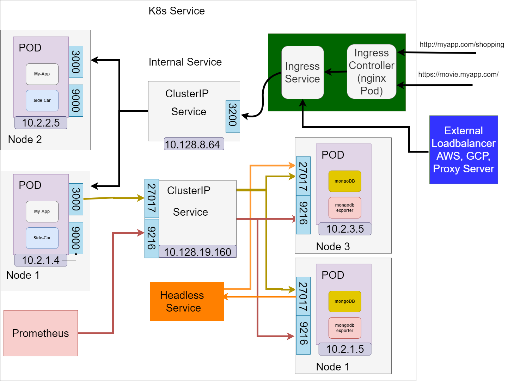
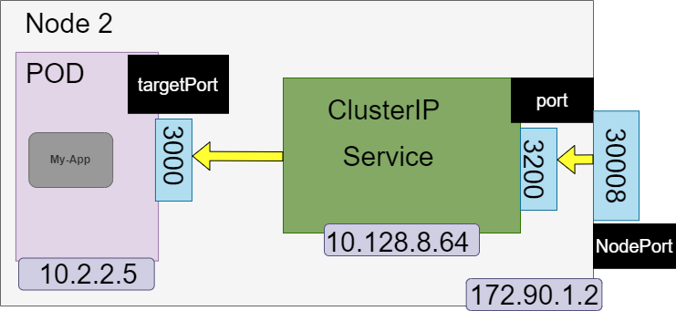
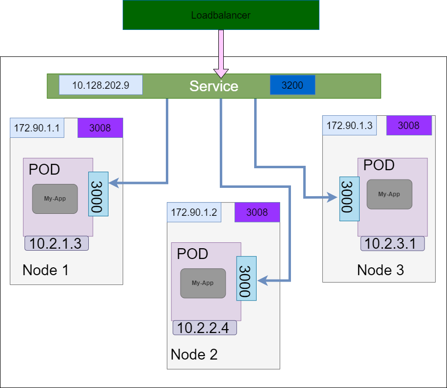

# Kubernetes
## VM vs Kubernetes
||VM|Kubernetes|
|---|---|---|
|Security|Not Secured|Secured|
|Portability|Not Portable|Portable|
|Time|More time consuming|Time is less|

# What is Kubernetes:
  - Open source platform used for maintaining and deploying group of container(docker)
# Benefits
  - portable and 100% open source
  - work load scalability
  - high availability
  - designed for deployment
  - service discovery and load balancing
  - storage orchestration
  - self healing
  - automated roll out and roll back
  - automatic bin packing

# Kubernets Architecture
## Control Plane:
  1. API Server:  - API servers perform all the administrative tasks on the master nodes. Users send the command to the API server, which then validates the request process and executes them. The API server determines if the request is valid or not and then processes it.

  2. Key-Value Store(etcd) - Etcd is an open-source distributed Key-Value Store used to hold and manage the critical information that distributed systems need to keep running. Is a database kubernetes uses to backup all the cluster data. It stores the entire configuration and state of the cluster.

  3. Controller - The role of the Controller is to obtain the desired state from the API server. It checks the current state of the nodes it is tasked to control, and determines if there are any differences.

  4. Scheduler - The Scheduler's main job is to watch for new requests coming from the API server and assign them to healthy nodes. It ranks the quality if the nodes and deploys pods to the best-suited node.


## Node Components(Worker nodes):
1. Container runtime - which runs on each work node. It pulls images and performs start stop. Docker is mostly used
2. kubelet - runs on each node in the cluster or can say kubernetes agent. It watches for tasks sent from the API Server, executes the task, and reports back to the Master.
3. Kube proxy - makes sure that each node gets its IP address. It runs on each worker node
4. A pod -  is the smallest element of scheduling in Kubernetes. Without it, a container cannot be part of a cluster.

## Services (What is it?) - Internal Service
- One of the best features kubernetes offers is that non-functioning pods get replaced by new ones automatically. The new pods have a different set of IPs. It can lead to processing issues and IP churn as the IPs no longer match. If left unattended, this property would make pods highly unreliable.
- It is component just like a Pod but not a process, it is just a abstraction layer that basically represent IP address
  - It will have its own IP address which it will be accessible
  - Also will have its own port and it is arbitrary, you can define your own Service Port
- Each Pod has its own IP address
  - Pods are ephemeral - are destroyed frequently
  - Thats why Service Provides
    - stable IP address
    - loadbalancing
    - loose coupling
    - within and outside cluster

## Types of services - There are three types
- 3 Service type attributes
  - clusterIP
  - NodePort
  - Loadbalancer

- ClusterIP (Default)
  - No type specified, it will automatically take clusterIP as a type
  - internal service
  - Accessible only within a cluster  
  - How does it work and where it is used
    - Lets say, we have microservice app deployed on port 3000
    - and side-car container on 9000, that collects microservice logs
    - Pod will get IP addresses from Node's range, example
      - Node1 has 10.2.1.x
      - Node2 has 10.2.2.x
      - Node3 has 10.2.3.x
    - It should have
      - kind: Service
      - name: Service Name
      - selector
        - app: app_name
      - ports
        - port: 3200 (serviceport)
        - targetPort: 3000 (Pod port)
    - Once the ingress hands over request to service, service knows where to send to request
      - How does service know which pods to forward the request to?
        - Pods are identified by "selector" attribute in service yaml file
        - And labels in deployment yaml file  
        - labels and selector should have same key value.
          - svc matches all the replicas
          - It registers as Endpoints
          - must match ALL the selectors
      - How does service know which port to forward the request to if pod has multiple ports open?
        - Using targetPort attribute, it is not arbitrary, it has to match the container's Port.
      - Service Endpoints
        - `kubectl get endpoints`\
        - K8s creates Endpoint object same name as Service
        - Keeps track of, which Pods are the members/endpoints of the Service
      - Multi-Port Service, how does it know? by name
        - Ports:
            - name: mongodb
              port: 27017
            - name: mongodb-exporter
              port: 9216

    - Get IP addresses of pod `kubetctl get pod -o wide`


  - Headless  
    - when do you use this?
      - Client wants to communicate with 1 specific Pod directly
      - Pods want to talk directly with specific Pod
      - so, not randomly selected
      - use Case: Stateful applications, like databases, mysql, mongodb, elasticsearch
        - Pod replicas are not identical,
          - master instance(reading and writing) <-- data replication -->  worker instance(reading)
          - when new work is started, it must connect directly to most recent worker node to clone the data from and get upto date state
          - Data synchronization
          - client wants to talk to pod directly
        - complex situation

    - Now, client needs to figure out IP addresses of each Pod
      - Option 1 - API call to K8s API server ?
        - makes app too tied to K8s API
        - inefficient
      - Option 2 - DNS lookup, Kubernetes allows client to discover Pod IP addresses through DNS lookups.
        - When a client  performs DNS lookup for a service, it return single IP address of a service(ClusterIP address)
        - But, we do not need clusterIP address of the service, by setting the `clusterIP: None` , then the DNS service will return the Pod IP address. Now a client can do simple DNS lookup to get the IP address of the Pods that are member of the service, and client can use the IP address to connect to the specific Pod or to all the Pods

    - No Cluster IP address is assigned  



- NodePort Service
  - Creates a service that is accessible on a static port on each worker node in a cluster
  - External traffic has access to fixed port on each worker Node!
    - ip-address worker node:NodePort
  - Defined in nodePort Attribute in a service yaml file
    - Ports:
      - protocol: TCP
        port: 3200
        targetPort: 3000
        nodePort: 30008
  - Has a predefine range between 30000 - 32767 , anything outside of this range will not be accepted.
  - ClusterIP Service is automatically created
  - NodePort will have the clusterIP address and for each IP address, it will also have the  Ports open where the service is accessible at.
  - NodePort Services not efficient and are not secured since it will be directly accessible to pod from outside cluster
  - So Better alternative is Loadbalancer Service type



- Loadbalancer Service
  - Service becomes accessible externally through cloud providers Loadbalancer
  - Whenever Loadbalancer Service is created, NodePort and ClusterIP are created automatically to which external Loadbalancer of the cloud platform will route the traffic to.
  - LoadBalancer Service is an extension of NodePort Service
  - NodePort Service is an extension of ClusterIP Service
  - Config:
  ```
  apiVersion: v1
  kind: Service
  metadata:
    name: ms-service-loadbalancer
  spec:
    type: LoadBalancer
    selector:
      app: microservice-one
    ports:
      - protocol: TCP
        port: 3200
        targetPort: 3000
        nodePort: 30010
  ```

  - `kubectl get svc`


  
  [[K8_service_loadbalancer.drawio.png|width=400px]]


  - NodePort Service NOT for external connection, use it for testing but not for production use cases.


# Docker Swarm
  - Used for managing container like kubernetes

# Docker Swarm VS Kubernetes
||DockerSwarm|Kubernetes|
|---|---|---|
|Scaling|No Auto Scaling| Auto Scaling|
|Load Balancing| Auto LB| Manually configures LB|
|Installation|Easy and Fast|Long and time consuming|
|scalability|Cluster strenght is weak when compare to Kubernetes|Cluster strength is strong|
|Storage Vol Sharing|Shares storage vol with any other container|Share storage vols b/w multiple container inside same pod|
|GUI|Not available|available|


# Hardware components
  - Nodes
    - is smallest unit of hardware in kubernetes. It is representation of a single machine in the cluster
    - Is a physical machine in a Datacenter, or virtual machine hosted in cloud.

  - Cluster
    - Kubernets does not work with individual nodes; it works with the cluster as whole
    - Nodes combine their resources to form a powerful machine known as cluster
    - When nodes is added or removed. the cluster shifts around the work as necessary
  - Persistent vol
    -
# Software components
- Container
  - The programs are bundled up into a single file(known as container) and shared on the internet.\
    Any one can download and deploy it with easy setup
  - Multiple programs are added to a single container. Limit to one process per container  as it will be \
    easy to deploy updates and diagnoses issues.
- pods
  - A pods represents a group of one or more application containers bundled up together and are highly scalable
  - if pods fails, kubernetes automatically deploys new replicas of pod to the cluster
  - Pods provide two different types of shared resources networking and storage.
- Deployment
  - Pods cannot be launched on a cluster directly; instead they are managed by one or more layer of abstraction call\
    the deployment.
```
apiVersion: apps/v1
kind: Deployment
metadata:
  name: backend
spec:
  selector:
    matchLabels:
      app: hello
      tier: backend
      track: stable
  replicas: 3
  template:
    metadata:
      labels:
        app: hello
        tier: backend
        track: stable
    spec:
      containers:
        - name: hello
          image: "gcr.io/google-samples/hello-go-gke:1.0"
          ports:
            - name: http
              containerPort: 80
 ```
- ingress
  - ingress allows access to kubernetes service from outside cluster
  - It can be done through ingress controller or LB
  - It can provide LB, SSL termination and name-based virtual hosting.
  - is an API object that provides routing rules to manage external users' access to the services in a Kubernetes cluster
  - Evalautes all the rules
  - Manages redirections
  - Entrypoint to cluster
  - It is managed using ingress controler Pod provided by Kubernetes itself K8s nignx Ingress Controller
  - There are many third party ingress implemention, ELB, Proxy server - this will be entrypoint to the cluster and then request will go to ingress controller.
  -

# Other components:
1. Replication controller
    - It is used to define pod lifecycle, rather than to create pods directly
2. Selector
    - A Selector expression matches labels to find specific resources
3. Labels
    - They are key value pairs that are attached to the objects, such as pods
4. Replication Set
    - they are define how many replicas of each pod will be running and manage and replace pods when they die
6. Annotation
    - It is a label with much data capacity. It is used only for storing data that is not searched but it is \
      required by the resources.
7. Name
    - Name by which resource is identified
8. Volume
    - A Vol is directory with data which is accessible to a container
9. Namespace
    - It provides additional qualification to a resource name
10. service
    - It is a abstraction on  top of pods which provides a single  IP address and DNS name by which \
      the pods can be accessed
    - A Service in Kubernetes is an abstraction which defines a logical set of Pods and a policy by which to access them. Services enable a loose coupling between dependent Pods.
```
apiVersion: v1
kind: Service
metadata:
  name: hello
spec:
  selector:
    app: hello
    tier: backend
  ports:
  - protocol: TCP
    port: 80
    targetPort: http
```
# Inteview Questions:
1. Why Kubernetes is widely used?
  - Kubernetes is an open source platform for automatic deployment and management of containers
    - Deployment
    - Scaling
    - Management
    - Effective persistent storage
    - support multi platform
    - Huge community support
2. What is difference between docker and kubernetes

|Features|Kubernetes|Docker|
|---|---|---|
|Deployment|Applications are deployed as a combination of pods, deployment, and services|Applications are deployed in a form of services|
|Autoscaling|Available|Not Available|
|Health Checks|Healths of two kinds: liveliness and readiness|The health checks are limited to services|
|setup|complicated to setup|Docker setup is easy|
|Tolerance Ration|High Fault tolerence |Low Fault tolerence|

3. What are notable feature of Kubernetes
  - Container Balancing
    - Kubernetes always know where to put the container
  - services
    - Manages container, offers security, networking, and storage services
  - self-monitoring
    - It monitors and continuously checks the health of nodes and containers
  - scaling
    - can scale vertically and horizontally
  - open-source
  - storage orchestration
    - Kubernetes mounts and adds storage system to run apps
4. What are the main advantages of Kubernetes?
  - Automated rollback for the changes that went wrong
  - Scaling resources
  - Automates many manual process
  - saves money by optimizing resources
5. Explain the architecture layer of Kubernetes
6. Explain master nodes and list of components
7. Explain Cluster
8. What the different types of controller ?
  - Node controller - controls and handles nodes in the system
  - service account - Enable access control in the system
  - Token controller  - Cleans up any tokens for non-existent service accounts
  - Endpoint controller  - Joins services and pods to the endpoint services
  - Replication controller - manages the pod lifecycle
9. What is the role of Cloud Controller manager ?
  - Is a essential component for persistent storage, the abstraction of code specific code from core kubernetes code\
    network routing
10. Rollback
  -  To display all the previous deployments
    `kubectl rollout history deployment <deployment_name>`
  -  To Restore the last deployment
    `kubectl rollout undo deployment <deployment_name>`
11. What is init container
  - A pod can have many containers. Init container gets executed before any other containers run in the pod
12. How do you package kubernetes application
  - helm is a package manager which allow user to package, configure and deploy the application and services to\
    the kubernetes cluster
    ```
    helm search redis
    helm install stable/redis
    helm ls
    ```
13. Zero down time deployment
  - By default deployment in Kubernetes using rolling update as strategy
    - Update the ngnix image
      `kubectl set image deployment ngnix ngnix=ngnix:1.15`
    - Check the replicas set
      `kubectl get replicasets`
    - Check the status of deployment rollout
      `kubectl rollout history deployment ngnix`
    - Check the revision in the deployment
      `kubectl rollout history deployment ngnix`
14. How do you monitor the pods that is always running
  - A liveness probe always checks if an application in a pod is running,\
    If the check fails, the container will get restarted
  - readiness probe
  - Three types of probe
    1. http
    2. command
    3. tcp

15. How do you drain traffic for maintenance\
  - `kubectl drain <nodename>`\
  - `kubectl uncordon <nodename>` # put the node back to rotation

# ConfigMaps
A ConfigMap is an API object used to store non-confidential data in key-value pairs. Pods can consume ConfigMaps as environment variables, command-line arguments, or as configuration files in a volume.

# Deployment types
1. Recreate deployment
- used in dev environment, running container is terminated and created with new contianer
2. Rolling update
- deploy new version of app, and terminate one version
- Deployment with new replicaSet is launched and replicaSet of old version is terminated. Eventually all the old version is terminated
3. Blue/green deployment
- Rapid transition from old version to new version, making sure new version works 100%.
- Green version is deployed with existing blue version.
- Once testing is completed, DNS is switched to new version.
4. Cannary deployment
- A smaller group of user are routed to new version of an application, once testing is error free, replicas of new version is scaled up and thus old version is replicaed in an orderly manner


# Firewall validation from Kubernetes cluster
1. Authenticate using pks: \
`./pks.exe get-kubeconfig cdp-dev-oobs-sit -u tdorji@example.COM -a example.com -k`

2. Login to container: \
- ssh to one of the running container: \
  `./kubectl.exe exec -it debug -n oobs-sali-sit -- /bin/sh `

- OR create new container: \
`./kubectl.exe run firewall-test --image=brix4dayz/swiss-army-knife --restart=Never -n namespace-dev`\
`./kubectl.exe exec -it firewall-test -n oobs-sali-sit -- /bin/sh`

- OR, this should work if none of the above two are not working\
`./kubectl.exe run -i -t --rm --image=brix4dayz/swiss-army-knife --restart=Never firewall-test -n namespace-dev`

3. using nc command to validate the firewall rules\
`nc -vz -w 2 111.111.111.111 443`
